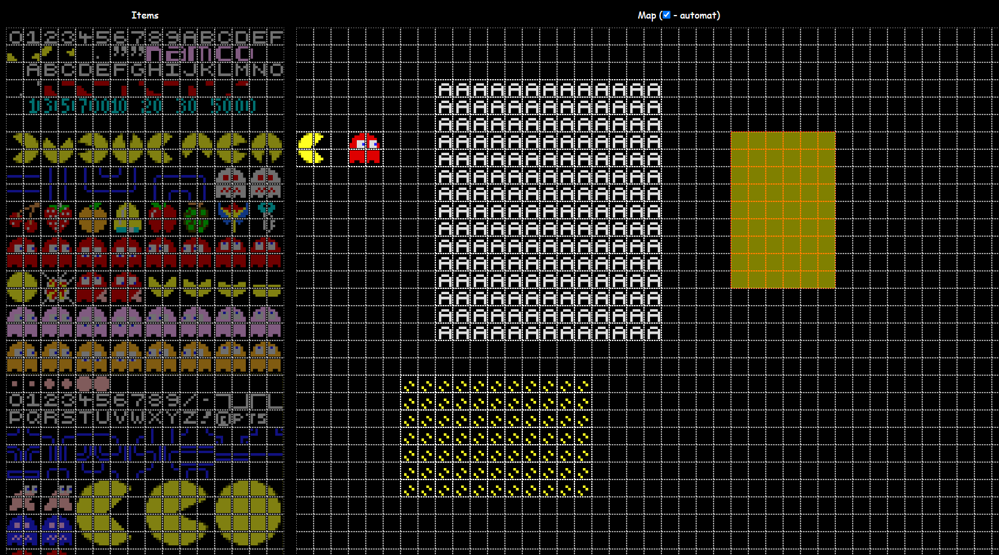
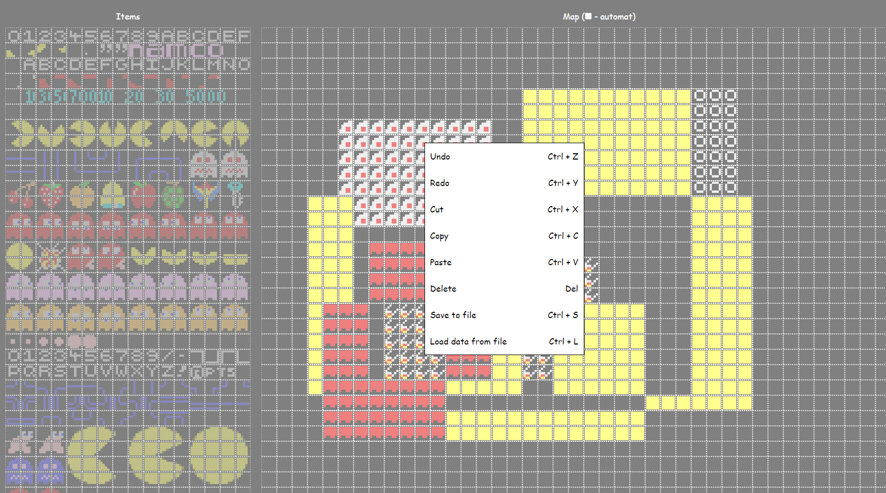

# PacManLevelEditor

School project 2023 
TS + HTML + CSS

live demo: [https://szyraf.github.io/PacManLevelEditor/](https://szyraf.github.io/PacManLevelEditor/)

## To run:

generate node_modules: 
`npm i`

ts -> js : 
`npm install -g typescript` 
`tsc ts/main.ts -w --outFile static/scripts/main.js --module amd`

run html file: 
`index.html`

or run server: 
`nodemon server.js` 
and open `localhost:3000`

## Screenshots

 

to deploy on github pages: 
`git subtree split --prefix static -b gh-pages`
`git push -f origin gh-pages:gh-pages`
`git branch -D gh-pages`
